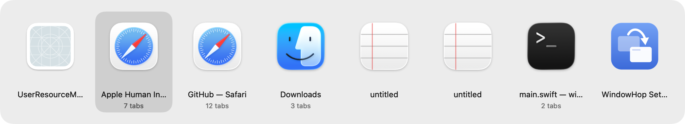
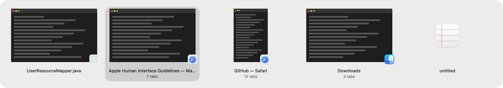
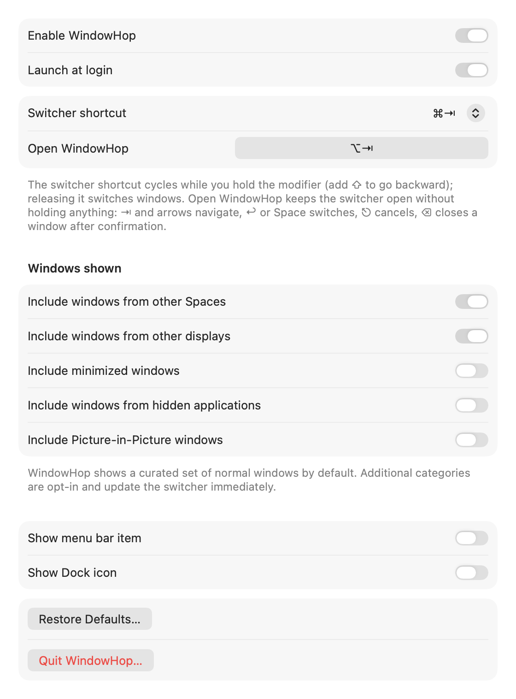

# WindowHop

**Switch between windows, not just apps.**

[](https://github.com/martonpaulo/windowhop/releases/latest)
[](https://github.com/martonpaulo/windowhop/actions/workflows/ci.yml)
[](LICENSE)


macOS's Command-Tab switches between *apps*. WindowHop switches between *windows*:
every window gets its own large tile, and releasing Command lands you on the exact
window you picked — even on another Space or display. Free, open source, native.



Prefer window snapshots? Turn on the optional **Window Previews** appearance:



## Download and install

1. **[⬇ Download WindowHop-1.1.0.dmg](https://github.com/martonpaulo/windowhop/releases/latest)**
2. Open the DMG and **drag WindowHop into Applications**.
3. First launch: **right-click WindowHop.app → Open → Open**. macOS asks once
   because releases aren't notarized by Apple (see Known limitations).
4. Grant the one permission it needs:
   **System Settings → Privacy & Security → Accessibility → enable WindowHop.**
   The welcome window takes you there. That's it — press ⌘⇥.

## Using WindowHop

| Keys | Action |
|---|---|
| **⌘⇥** | Open the switcher and select your previous window |
| **⌘⇥⇥…** (keep holding ⌘) | Cycle forward |
| **⇧⌘⇥** | Cycle backward |
| **Release ⌘** | Switch to the selected window |
| **← → ↑ ↓** | Navigate |
| **↩** | Switch to the selected window |
| **⎋** | Cancel, stay where you were |
| **⌫** | Close the selected window (always asks first) |
| **⌘,** | Open WindowHop Settings |
| **Click** | Switch to a window; click outside cancels |

Hover a tile for a close button; hover the panel for a Settings button. The close
dialog can also **Quit** the app — and offers a separately confirmed **Force Quit**
if an app refuses to quit. Closing always preserves the app's own unsaved-changes
questions.

**One entry per window, never per tab.** A Safari window with 5 tabs is one entry
showing "5 tabs". Finder/Terminal tab groups collapse to their visible tab.

### The "Open WindowHop" shortcut

Prefer not to hold a modifier? Assign a second shortcut (say ⌥Space) in Settings →
General. It opens the switcher and *keeps it open*: ⇥/⇧⇥/arrows navigate, ↩ or
Space switches, ⎋ cancels. Unassigned by default.

### App Icons vs Window Previews

Settings → **Appearance**. *App Icons* (default) shows each window as a large app
icon and needs no extra permission. *Window Previews* shows a snapshot of each
window and needs **Screen Recording** permission (macOS requires it); WindowHop
asks only when you pick previews, and falls back to icons until it's granted.
Previews are generated on your Mac, kept temporarily in memory only while the
switcher is open, never written to disk, never transmitted.

## Settings

Native multi-pane Settings — General, Appearance, Updates, About. Launching
WindowHop again (Finder, Spotlight, Dock) opens Settings even with the menu bar
item and Dock icon hidden (both hidden by default).



## Automatic updates and privacy

WindowHop updates itself with [Sparkle](https://sparkle-project.org): it checks a
feed on GitHub and cryptographically verifies (EdDSA) every update before
installing — a plain native dialog, no embedded web pages. Control it in
Settings → Updates, which also shows when a newer version is available.
**Update checks are WindowHop's only network activity** — no telemetry, no
analytics, no accounts.

## Uninstall

Quit WindowHop (menu bar item → Quit, or via Activity Monitor), then delete
`/Applications/WindowHop.app`. Optional cleanup:
`defaults delete com.perso.windowhop` and remove WindowHop from
System Settings → Privacy & Security → Accessibility (and Screen Recording).

## Troubleshooting

- **⌘⇥ shows the old macOS switcher** — WindowHop isn't running, is disabled, or
  lost Accessibility permission. That's the fail-safe: native switching always keeps
  working.
- **The Accessibility toggle doesn't stick** — the welcome window has a
  "Reset Stuck Permission…" button that clears the stale entry so you can grant
  it fresh. Also make sure WindowHop was dragged into Applications with Finder
  (running it straight from the DMG or Downloads triggers macOS App
  Translocation, where no grant can persist — WindowHop warns about this).
  Since 1.0.2, releases carry a stable signing identity, so the grant survives
  updates.
- **Previews are icons instead of snapshots** — grant Screen Recording in
  System Settings → Privacy & Security, then relaunch WindowHop.
- **A window is missing** — minimized windows, hidden apps, and floating
  Picture-in-Picture panels are excluded by design; a window on an unvisited
  Space appears after you visit that Space once.
- **Typing a password?** Secure input pauses interception; ⌘⇥ is native until done.

## Build from source

macOS 14+, Xcode 16+ (free); no paid account needed.

```sh
git clone https://github.com/martonpaulo/windowhop && cd windowhop
swift test                # test suite
scripts/validate.sh       # repository invariants
scripts/package-app.sh    # build/WindowHop.app (ad-hoc signed)
scripts/make-dmg.sh       # the installer DMG
```

Docs: [architecture](docs/architecture.md) · [testing](docs/testing.md) ·
[contributing](CONTRIBUTING.md) · [upstream attribution](UPSTREAM.md)

## Known limitations

- **Not notarized** (requires a paid Apple Developer account), so macOS shows a
  one-time warning on first launch. The release workflow signs and notarizes
  automatically once Developer ID credentials are configured.
- **Windows on unvisited Spaces** appear only after that Space is visited once
  while WindowHop runs — a limitation of macOS's public Accessibility API
  (WindowHop deliberately uses no private APIs, unlike AltTab).
- **Tab counts** appear only for apps exposing native tab groups (Safari, Finder,
  Terminal, TextEdit, …); Chrome-style custom tabs show no count — never guessed.
- English-only interface in this release.

## License and attribution

[GPL-3.0](LICENSE). Derived from
[AltTab](https://github.com/lwouis/alt-tab-macos) by Louis Pontoise (lwouis) and
contributors — base tag `v10.12.0` (`317a485b`), full upstream history preserved
in this repository. See [UPSTREAM.md](UPSTREAM.md). Thank you, AltTab.
