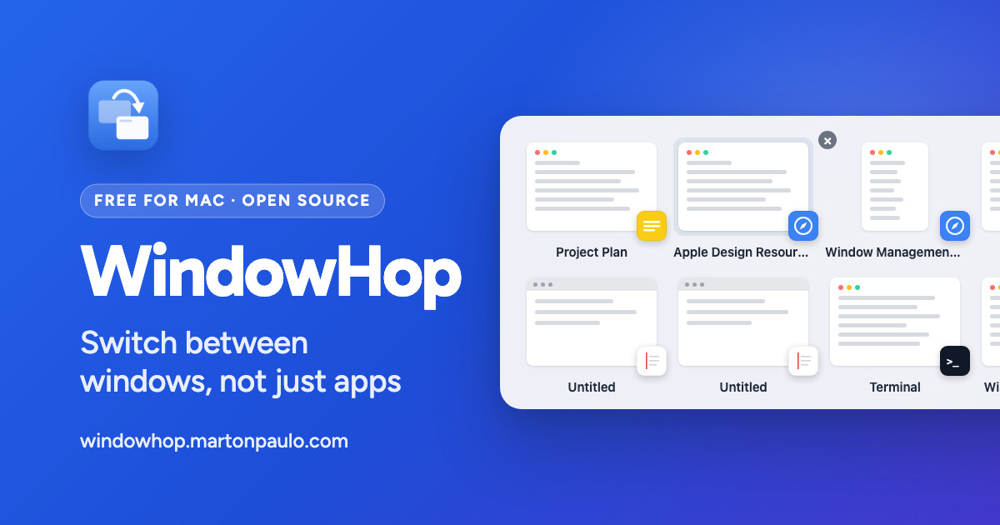

<div align="center">



# WindowHop

Switch between windows, not just apps — a fast, native macOS window switcher with large app icons or live previews, free and without telemetry.

[](https://github.com/martonpaulo/windowhop/actions/workflows/validate.yml) [](https://github.com/martonpaulo/windowhop/actions/workflows/release.yml) [](https://swift.org/) [](https://developer.apple.com/xcode/) [](https://sparkle-project.org/)

</div>

macOS Command-Tab switches between **apps**. WindowHop gives **every top-level window its own tile**,
then lands on the exact window you select — including windows on another Space or display. Tabs are
never separate entries, and the native shortcut keeps working if WindowHop is not running: that is
the fail-safe, not a fallback.

It is **native, free, open source, and contains no telemetry**. Sparkle update checks are its only
network activity; there are no accounts, no analytics, and no advertising. App Icons is the default
and needs no Screen Recording permission — **Window Previews** is an explicit opt-in whose captures
stay in memory and are never written to disk or transmitted.

---

<br />

## 🌱 Quick Start

Requires **macOS 14+** and **Xcode 16+** command line tools. No paid Apple account is needed.

```sh
git clone https://github.com/martonpaulo/windowhop
cd windowhop
swift build && swift test
scripts/validate.sh
scripts/package-app.sh <version> <build>   # e.g. 1.6.2 10602
scripts/make-dmg.sh <version>
```

Then open the packaged app and grant **System Settings → Privacy & Security → Accessibility**.
Local packages are ad-hoc signed unless `DEVELOPER_ID_IDENTITY` names the approved Developer ID
identity; official tags run the fail-closed signing, notarization, stapling, Gatekeeper, Sparkle,
and GitHub Release workflow.

<br />

## 🛠 Commands

| Command | What it does |
| --- | --- |
| `swift build` / `swift build -c release` | Debug and release builds |
| `swift test` | The unit suite — must pass with zero warnings |
| `scripts/validate.sh` | Repository invariants: layering, ScreenCaptureKit confinement, docs, site |
| `scripts/package-app.sh [version] [build]` | Assembles `build/WindowHop.app` with Sparkle embedded, plus its zip |
| `scripts/make-dmg.sh [version]` | Builds the branded DMG from `build/WindowHop.app` |
| `scripts/make-appcast.sh` | Regenerates `appcast.xml` for Sparkle |
| `scripts/capture-screenshots.sh` | Published screenshots (a Retina display is required) |
| `scripts/verify-release-identity.sh` | Compares code identity against the previous official release |
| `scripts/verify-dmg-branding.sh` / `scripts/verify-update-continuity.sh` | Release gates for DMG branding and Sparkle continuity |
| `scripts/publish-release.sh` | The publication step the tag workflow runs |

Runtime checks on the debug binary (Accessibility permission is inherited from a trusted terminal):

```sh
.build/debug/WindowHop --dump-windows           # real discovery works?
.build/debug/WindowHop --dump-previews          # entry → captured window pairing (no image)
.build/debug/WindowHop --render-ui /tmp/shots   # switcher + settings, light/dark/overflow
.build/debug/WindowHop --demo-switcher [--dark] [--many]
.build/debug/WindowHop --updater-e2e <feed-url> # headless Sparkle end-to-end
WINDOWHOP_DEBUG=1 .build/debug/WindowHop        # diagnose input/session behavior
```

<br />

## 🔐 Secrets and variables

The app itself reads **no secret**: it has no account, no API key, and no credential of its own.
Everything below belongs to the **release pipeline** (`.github/workflows/release.yml`), which is
push-only on a `vX.Y.Z` tag, so these values are never exposed to pull requests or fork workflows.
Names only — no value ever enters the repository, a commit message, an issue, or a log.

| Secret | Purpose |
| --- | --- |
| `DEVELOPER_ID_CERT_P12` | Base64-encoded Apple-issued Developer ID Application certificate |
| `DEVELOPER_ID_CERT_PASSWORD` | Import password for that P12 |
| `NOTARIZATION_APPLE_ID` | Apple Developer account email used for notarization |
| `NOTARIZATION_PASSWORD` | App-specific password for that Apple ID |
| `NOTARIZATION_TEAM_ID` | Apple Developer team identifier |
| `SPARKLE_PRIVATE_KEY` | EdDSA key that signs the update archive |

| Local variable | Purpose |
| --- | --- |
| `DEVELOPER_ID_IDENTITY` | Names the approved Developer ID identity for a local package; without it, packaging is ad-hoc signed |
| `WINDOWHOP_DEBUG` | Set to `1` to log input and session behavior while diagnosing |

The Sparkle EdDSA private key lives in the login Keychain and in the `SPARKLE_PRIVATE_KEY` secret.
Never tag a release to test credentials; use the local packaging commands and Apple tooling directly.

---

<br />

## Using WindowHop

| Keys | Action |
|---|---|
| **⌘⇥** | Open and select the previous window |
| **⌘⇥⇥…** while holding ⌘ | Cycle forward |
| **⇧⌘⇥** | Cycle backward |
| **Release ⌘** | Confirm and activate the selected window |
| **← → ↑ ↓** | Navigate |
| **↩** or **Space** | Confirm the selected window |
| **⎋** | Cancel without changing the desktop |
| **⌫** | Close the selected window after confirmation |
| **⌘,** | Open Settings without confirming or cancelling |
| **Click** | Confirm a tile; click outside to cancel |

Hovering reveals a Close control centered on the preview canvas's top-left point. It
always targets that tile and uses a 44 pt hit area without moving the card. During normal
cycling, the global Settings control appears only while the pointer is anywhere over the
panel. It remains visible for the complete persistent **Open WindowHop** session. In both
cases it overlaps the top-right corner without taking layout space or moving previews.
Close always asks first; Quit is graceful, and Force Quit has its own second warning.

### Expanded preview after pausing

Pause on the selected tile for the configured delay (3 seconds by default) and
WindowHop enlarges the latest snapshot **inside the switcher**. It never activates,
raises, focuses, reorders, or moves the real window. Navigation remains available;
moving to another tile closes the expanded view and starts a new delay. Confirming
activates the current target immediately. Cancelling leaves the originally focused
window and desktop stacking unchanged.

### One entry per window

Tabs are never separate switcher entries. Finder, Safari, and Terminal tab groups collapse
to their visible top-level window. Optional tab-count metadata is hidden by default and
can be enabled in Settings → Appearance without changing preview width.

### Open WindowHop shortcut

Use **⌥Tab** (configurable in Settings → Shortcuts) when you do not want to hold a modifier.
It opens a sticky session: Tab, Shift-Tab, and arrows navigate; Return or Space confirms;
Escape cancels.

<br />

## Preview behavior and permissions

**App Icons** is the default and needs no Screen Recording permission. **Window
Previews** uses ScreenCaptureKit only while the switcher is open. Captures remain in
memory and are never written to disk or transmitted. A cached preview may appear first;
a fresh capture replaces it in place.

Every preview keeps one fixed 16:10 canvas, the same on every monitor. Wide, tall, and narrow windows are
scaled proportionally and centered over an adaptive semantic surface — never stretched,
cropped, or left as a transparent hole. The app badge remains attached to the canvas's
bottom-right corner in every state.

| State | What WindowHop shows |
|---|---|
| Capturing | A gently pulsing macOS-window skeleton |
| Screen Recording is missing | A static subdued skeleton; one panel-level Settings action |
| Capture failed while permission exists | A static unavailable skeleton |
| Capture succeeded | The current snapshot |

Missing permission is checked before capture starts, so it cannot masquerade as loading
or enter a retry loop. Returning from Privacy & Security refreshes the state; once
permission exists, capture starts without moving the cards.

<br />

## Settings and defaults

Settings has six native panes: General, Shortcuts, Windows, Appearance, Updates, and
About. Every pane shares one window size, so selecting a pane never resizes or re-centers
the window, and no pane runs off the bottom of a laptop display. Changes persist and apply
immediately when safe; invalid stored values restore documented defaults.

### General

- Enable WindowHop — **on**
- Launch at login — **on**
- Show menu bar item — **off**
- Show Dock icon — **off**
- Restore Defaults… — confirmed action that restores every configurable preference
- Quit WindowHop… — confirmed graceful termination

### Shortcuts

- Switcher shortcut — **⌘Tab**
- Open WindowHop shortcut — **⌥Tab**

A recorded Open WindowHop chord that conflicts with the switcher shortcut is rejected with
an explanation instead of being stored.

### Windows

- Include windows from other Spaces — **on**
- Include windows from other displays — **on**
- Include minimized windows — **off**
- Include windows from hidden applications — **off**
- Include Picture-in-Picture windows — **off**
- Show the switcher on — **All displays**, the display with the pointer, or a specific display

The switcher appears on every display by default; on a single-display Mac nothing changes.
"The display with the pointer" is the one you are looking at, which is not always the one
holding keyboard focus. A specific display is remembered by a stable identifier, so
unplugging it falls back to the display with the pointer and reconnecting restores your
choice without reconfiguring anything. This setting controls *where the switcher appears*;
"Include windows from other displays" above controls *which windows it lists*.

The default is intentionally a curated set of normal windows. Inclusion toggles are
explicit opt-ins, rebuild the available list, and do not weaken the invariants that
exclude menus, tooltips, tab siblings, system overlays, or WindowHop's own helper UI.

### Appearance

- Switcher shows — **App Icons** or Window Previews; default **App Icons**
- Show tab counts — **off**
- Show an expanded preview after pausing — **Off, 1, 2, 3, or 5 seconds**; default
  **3 seconds**
- Screen Recording status and the single permission action for Window Previews

### Updates and About

Automatic checks are enabled by default. Sparkle verifies the EdDSA signature and Apple
code signature before replacing the app in place; the Settings pane also offers a manual
check. About identifies **Developed by Marton Paulo** and links to the project's source,
issue tracker, GPL-3.0 license, and AltTab acknowledgement.

<br />

## Updates, signing, and privacy

WindowHop uses [Sparkle](https://sparkle-project.org) and GitHub Releases. Update checks
are its only network activity. There are no accounts, analytics, advertising, or
telemetry. Official release automation refuses to publish if the Developer ID identity,
nested signatures, hardened runtime, designated requirement, notarization, stapling,
Gatekeeper assessment, DMG branding, or Sparkle signature is missing or inconsistent.

The bundle identifier, Team ID, leaf Developer ID certificate, entitlements, and exact
designated requirement are validated against the previous official release. This keeps
macOS TCC permissions associated with the same code identity across Sparkle updates and
manual in-place replacement.

### One-time recovery for an already-corrupted grant

Only users whose Accessibility entry was created by an old ad-hoc, development-signed,
translocated, or otherwise differently identified build may need one repair: remove the
stale WindowHop entry from Privacy & Security → Accessibility, install the current
official build in Applications, and grant it once. Normal signed updates must not require
this again.

<br />

## Troubleshooting

- **⌘Tab shows Apple's switcher** — WindowHop is not running, is disabled, or lacks
  Accessibility. This is the fail-safe; WindowHop never disables the native shortcut.
- **Window Previews remain static** — use the one panel or Settings action to open Screen
  Recording, enable WindowHop, then return to the app. App Icons remains fully usable
  without it.
- **A window is missing** — minimized, hidden-app, and PiP windows are excluded by
  default and can be enabled under Settings → Windows. Public Accessibility APIs
  reveal an unvisited Space only after you visit it once.
- **A previous build's Accessibility toggle does not stick** — ensure WindowHop is in
  Applications and use the one-time recovery above. Running directly from Downloads or
  the DMG can trigger App Translocation.
- **Secure input is active** — password fields make WindowHop pass ⌘Tab through to the
  native switcher until secure input ends.

<br />

## Uninstall

Quit WindowHop, delete `/Applications/WindowHop.app`, and optionally run
`defaults delete com.perso.windowhop`. You can also remove WindowHop from Accessibility
and Screen Recording in System Settings.

<br />

## Documentation

| Document | What it covers |
| --- | --- |
| [`docs/architecture.md`](docs/architecture.md) | Layering, threading rules, and where each responsibility lives |
| [`docs/testing.md`](docs/testing.md) | The suite, the runtime checks, and the Sparkle end-to-end harness |
| [`docs/feature-defaults.md`](docs/feature-defaults.md) | The contract every user-facing default must satisfy |
| [`docs/website.md`](docs/website.md) | How the site is built and deployed |
| [`AGENTS.md`](AGENTS.md) | The complete product and repository working agreements |
| [`CONTRIBUTING.md`](CONTRIBUTING.md) | How to report a bug or propose a change |
| [`UPSTREAM.md`](UPSTREAM.md) | Upstream attribution and the base tag this work derives from |
| [`CHANGELOG.md`](CHANGELOG.md) | Every released version |

---

<br />

## Limitations

- Other-Space windows become discoverable only after that Space has been visited while
  WindowHop runs; WindowHop deliberately uses no private APIs.
- Tab counts exist only for apps exposing native tab groups and are never guessed.
- Screen Recording's public preflight API distinguishes authorized from unavailable but
  does not expose whether an unavailable grant is specifically denied or restricted;
  both correctly use the static permission-blocked fallback and single recovery action.
- English-only interface in this release.

<br />

## License and attribution

[GPL-3.0](LICENSE) © 2026 Marton Paulo.

Derived from [AltTab](https://github.com/lwouis/alt-tab-macos) by Louis Pontoise (lwouis) and contributors — base tag `v10.12.0` (`317a485b`), with upstream history preserved.

Upstream attribution in [UPSTREAM.md](UPSTREAM.md).
