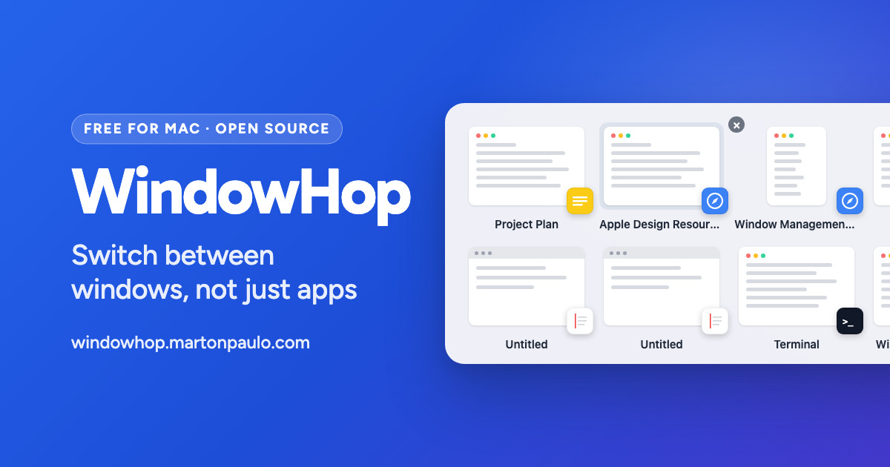

<div align="center">



# WindowHop

Switch between windows, not just apps. Fast, native macOS window switcher with large app icons or live previews — free, GPL, no telemetry.

**[Download WindowHop](https://github.com/martonpaulo/windowhop/releases/latest)** · [Website](https://windowhop.martonpaulo.com/) · [Help](https://windowhop.martonpaulo.com/help/)

[](https://github.com/martonpaulo/windowhop/releases) [](https://github.com/martonpaulo/windowhop/stargazers) [](https://github.com/martonpaulo/windowhop/releases/latest) [](LICENSE)

[](https://github.com/martonpaulo/windowhop/actions/workflows/validate.yml) [](https://github.com/martonpaulo/windowhop/actions/workflows/deploy.yml) [](https://github.com/martonpaulo/windowhop/actions/workflows/release.yml)

[](https://swift.org/) [](https://developer.apple.com/xcode/) [](https://sparkle-project.org/) [](https://www.apple.com/macos/)

</div>

## Why WindowHop

On a Mac, <kbd>⌘</kbd> <kbd>Tab</kbd> switches between **apps**. When you have three browser
windows or four terminals open, you still have to find the right window after that.

WindowHop gives **every window its own tile**. Hold <kbd>⌘</kbd>, press <kbd>Tab</kbd> until
the window you want is selected, and release. You land on that exact window, also when it is
on another Space or another display.

- **One tile per window.** A window with ten tabs is one tile, not ten.
- **Two looks.** Large app icons (the default), or live previews of each window.
- **Safe.** If WindowHop is not running, <kbd>⌘</kbd> <kbd>Tab</kbd> works as it always did.
- **Private.** No account, no tracking. Previews stay in memory and are never saved or sent.
- **Free and open source** under GPL-3.0.

## Requirements

- A Mac with Apple silicon (M1 or later)
- macOS 26 or later

## Install

1. Download `WindowHop-<version>.dmg` from the
   [latest release](https://github.com/martonpaulo/windowhop/releases/latest).
2. Open the file and drag **WindowHop** to the **Applications** folder.
3. Open WindowHop from Applications. It is signed and notarized by Apple.
4. WindowHop asks for **Accessibility** permission. Choose **Open System Settings** and turn
   on WindowHop. It needs this permission to see your windows and switch to them.

**With Homebrew** instead, in Terminal:

```sh
brew install --cask martonpaulo/tap/windowhop
```

Then open WindowHop from Applications and allow Accessibility (step 4).

That is all. WindowHop updates itself: it checks for new versions and asks before it installs
one.

## Use it

Hold <kbd>⌘</kbd> and press <kbd>Tab</kbd>. The switcher shows your windows, with the
previous window selected. Press <kbd>Tab</kbd> again to move, then release <kbd>⌘</kbd> to
switch.

| Keys | What they do |
| --- | --- |
| <kbd>⌘</kbd> <kbd>Tab</kbd> | Open the switcher and select the previous window |
| <kbd>Tab</kbd> or <kbd>→</kbd> | Next window |
| <kbd>⇧</kbd> <kbd>Tab</kbd> or <kbd>←</kbd> | Previous window |
| Release <kbd>⌘</kbd>, or <kbd>Return</kbd> | Switch to the selected window |
| <kbd>Esc</kbd> | Close the switcher and stay where you are |
| <kbd>Delete</kbd> | Close the selected window (WindowHop asks first) |
| <kbd>⌘</kbd> <kbd>,</kbd> | Open Settings |
| Click a tile | Switch to that window |

**Do not want to hold a key?** Press <kbd>⌥</kbd> <kbd>Tab</kbd>. The switcher stays open
until you choose a window with <kbd>Return</kbd>, <kbd>Space</kbd> or a click, or close it
with <kbd>Esc</kbd>. You can change both shortcuts in Settings → Shortcuts.

### Settings

To open Settings, press <kbd>⌘</kbd> <kbd>,</kbd> while the switcher is open, or open
WindowHop again from Applications. Settings has four panes:

- **General**: turn WindowHop on or off, open it at login, show it in the menu bar or the
  Dock, and see whether Accessibility is allowed.
- **Shortcuts**: the switcher shortcut (<kbd>⌘</kbd> <kbd>Tab</kbd>), the Open WindowHop
  shortcut (<kbd>⌥</kbd> <kbd>Tab</kbd>), a short delay before the switcher appears, and the
  keys you can use in it.
- **Switcher**: App Icons or Window Previews, tab counts, which windows to list (other
  Spaces, other displays, minimized windows, hidden apps, Picture in Picture), and the
  display the switcher opens on.
- **About**: the version, updates, and links to the website and to this repository.

**Restore Defaults…** in General puts every setting back to its default.

## Window Previews

App Icons, the default, needs no other permission. To see a small picture of each window
instead, choose **Window Previews** in Settings → Switcher. macOS then asks for **Screen
Recording** permission.

WindowHop takes the pictures only while the switcher is open. It keeps them in memory, and
never saves them to disk or sends them anywhere. If you stay on one window for a moment
(3 seconds by default), WindowHop shows a larger picture of it. The real window does not
move until you choose it.

## Check that it works

Hold <kbd>⌘</kbd> and press <kbd>Tab</kbd>. If you see WindowHop's switcher with one tile
per window, it works. If you see Apple's app switcher instead, read the next section.

## When something does not work

- **<kbd>⌘</kbd> <kbd>Tab</kbd> shows Apple's switcher.** WindowHop is not open, is turned
  off in Settings → General, or does not have Accessibility permission. When WindowHop cannot
  answer, the Mac's own switcher does. A password field also sends <kbd>⌘</kbd>
  <kbd>Tab</kbd> to Apple's switcher until you leave that field.
- **A window is missing.** Minimized windows, windows of hidden apps and Picture in Picture
  windows are not listed by default. Turn them on in Settings → Switcher. A window on another
  Space appears after you visit that Space once while WindowHop is running.
- **Previews stay grey.** Screen Recording is not allowed. Use the button in the switcher
  or in Settings → Switcher, turn on WindowHop in System Settings, then come back.
- **The Accessibility switch does not stay on.** Remove WindowHop from System Settings →
  Privacy & Security → Accessibility, make sure WindowHop is in Applications, open it from
  there, and allow it again.

Still stuck? [Report an issue](https://github.com/martonpaulo/windowhop/issues/new/choose),
or use **Report an Issue…** in Settings → About, which fills in your versions for you.

## Privacy

WindowHop has no account, no analytics and no advertising. The only thing it sends over the
internet is the update check. You can read every line of the code in this repository.

## Limitations

- Windows on a Space you have not visited since WindowHop started are not listed yet. This
  is because WindowHop uses only public Apple interfaces.
- Tab counts appear only for apps that use the standard macOS tabs.
- WindowHop does not search window titles, arrange windows, or open apps.
- English only.

## Uninstall

1. Quit WindowHop: choose **Quit WindowHop…** in Settings → General.
2. Move WindowHop from Applications to the Trash, or, if you installed it with Homebrew, run
   `brew uninstall --zap --cask windowhop`, which also removes its settings.
3. Optional: remove WindowHop from System Settings → Privacy & Security → Accessibility and
   Screen Recording.

## For developers

Build instructions, commands, the release process and the project rules are in
[CONTRIBUTING.md](CONTRIBUTING.md). The documentation for each part of the code is in
[`docs/`](docs/), and [CHANGELOG.md](CHANGELOG.md) lists every version.

## License and credits

[GPL-3.0](LICENSE) © 2026 Marton Paulo.

WindowHop is derived from [AltTab](https://github.com/lwouis/alt-tab-macos) by Louis Pontoise
(lwouis) and contributors, base tag `v10.12.0` (`317a485b`), with its history kept.
[UPSTREAM.md](UPSTREAM.md) has the details.
