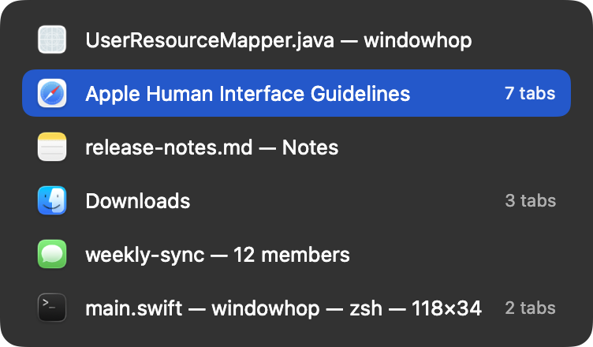
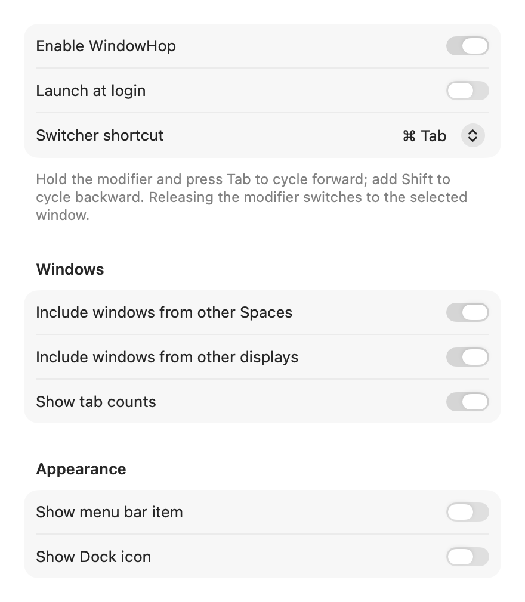

# WindowHop

A fast, native, keyboard-first window switcher for macOS. **Icons and window titles — no previews.**

WindowHop replaces Command-Tab with a window switcher instead of an app switcher: every
window is one row, you always see its title, and releasing Command lands you on the exact
window you picked. It is completely free, open source (GPL-3.0), and works entirely offline —
no accounts, no license keys, no telemetry, no updates that phone home.

| Light | Dark |
|---|---|
|  |  |

## What it does

- **Cmd-Tab** opens the switcher and selects your previously focused window; keep holding
  Command and press Tab to cycle. **Cmd-Shift-Tab** cycles backward (always available).
- **Release Command** to switch to the selected window. **Escape** cancels. **Return**
  activates. **Arrow keys** navigate. **Click** an entry to switch; click outside to cancel.
- **Delete/Backspace** asks to close the selected window — always with a confirmation
  dialog (`Close "UserResourceMapper.java" in IntelliJ IDEA?`) where Cancel is the default.
  The target app's own unsaved-changes flow is preserved.
- Shows **individual windows only**: never appears for minimized windows, windows of
  Command-H-hidden apps, or apps without windows. Menus, tooltips, and other non-window
  surfaces are filtered with rules inherited from AltTab.
- Shows a **tab count** (e.g. `7 tabs`) when a window exposes native macOS tabs through
  the Accessibility API (Safari, Finder, Terminal, …). Never guessed, never parsed from titles.
- Window-level **most-recently-used ordering**; windows from **other Spaces and displays**
  included by default.
- Full-screen friendly, Light/Dark Mode, Reduce Transparency/Motion, Increase Contrast,
  and VoiceOver announcements.

## What it deliberately does not do

No window previews or thumbnails, no screen capture, no search, no tiling or layout
management, no app launching, no themes. One job: switch to the exact window you want.

## Install

WindowHop is free to build and use. There is no notarized download (that would require a
paid Apple Developer account); build it from source:

```sh
git clone https://github.com/martonpaulo/windowhop && cd windowhop
scripts/package-app.sh          # builds build/WindowHop.app (ad-hoc signed)
cp -R build/WindowHop.app /Applications/
open /Applications/WindowHop.app
```

Because the app is ad-hoc signed, the first launch may require right-click → Open, or
approval under System Settings → Privacy & Security.

### Permission

WindowHop needs exactly one permission: **Accessibility** (System Settings → Privacy &
Security → Accessibility). macOS requires it for listing windows and switching to them.
WindowHop never requests Screen Recording — it has nothing to record.

### Settings



Launching WindowHop again (Finder, Spotlight, Dock) opens Settings even when the menu bar
item and Dock icon are hidden (both are hidden by default).

## Fail-safe by design

WindowHop never touches the native macOS app switcher: it intercepts Command-Tab with a
consuming event tap while enabled. If WindowHop is disabled, quits, crashes, or loses its
permission, the event tap disappears and native Command-Tab keeps working — there is
nothing to restore.

## Build and test

Requires Xcode 26+ (Swift 5.10+ toolchain), macOS 14+.

```sh
swift build                      # debug build
swift test                       # unit tests
swift build -c release           # release build
scripts/package-app.sh           # release .app + artifacts/WindowHop-release.zip
```

Development harness (see [docs/testing.md](docs/testing.md)):

```sh
.build/debug/WindowHop --dump-windows          # print the live switcher list (needs Accessibility)
.build/debug/WindowHop --demo-switcher [--dark] # show the panel with sample rows (no permission needed)
.build/debug/WindowHop --render-ui <dir>        # render UI screenshots to PNGs
WINDOWHOP_DEBUG=1 .build/debug/WindowHop        # run with input/session diagnostics
```

## Measured performance

On an Apple Silicon Mac (macOS 26.5), Release-equivalent runs measured during development:

- Trigger to visible panel: **3–22 ms** (first open is the slow end; subsequent opens ~10 ms)
- Event-tap callback to main-thread hand-off: **< 0.4 ms**
- Idle CPU: **0.0 %** (event-driven only; no polling, no timers while idle)
- Memory: **~63 MB RSS** with the engine running

## Known limitations

WindowHop uses only supported public Apple APIs (AltTab uses private SkyLight/CGS calls
for some of this). The honest consequences:

- **Windows on other Spaces** are listed once discovered. macOS's public Accessibility API
  does not enumerate other-Space windows, so a window that existed on another Space before
  WindowHop launched appears after that Space is visited once. Windows stay tracked when
  you move between Spaces.
- **Secure input** (password fields) suspends keyboard event taps system-wide; while a
  password field is focused, Command-Tab falls back to the native switcher.
- Windows of apps that render no standard Accessibility metadata may be missing or
  untitled; app-specific rules cover the common offenders (JetBrains, Steam, Firefox, …).
- Ad-hoc signing only; no notarization (requires a paid Apple Developer account).

## License and attribution

GPL-3.0 — see [LICENSE](LICENSE).

WindowHop is derived from [AltTab](https://github.com/lwouis/alt-tab-macos) by Louis
Pontoise (lwouis) and contributors, base tag `v10.12.0`
(`317a485bcb090bf2b29e3f78872218f0099e1d62`). The full upstream Git history is preserved
in this repository. See [UPSTREAM.md](UPSTREAM.md) for what was retained, rewritten, and
removed.
